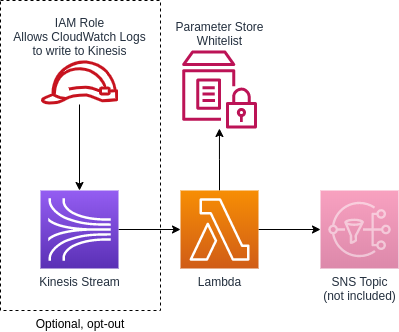

# Sniffles

AWS CloudWatch log group alerting.

## Overview

Sniffles is a collection of CloudFormation templates and lambdas that you can compose together to suit your needs.

There are two ways to monitor log groups:

- A lambda looks through every log entry and sends you the logs you care about, or
- CloudWatch alarm whenever a log you care about appears

Lambda solution pros:

- You receive the log entry in the alert

CloudWatch alarm solution pros:

- You can alarm only after a threshold during a timeperiod has been reached
- Lambda-less (no maintenance)

Log groups can of course be monitored with both solutions.

## Quickstart

Prerequisites:

- [AWS CLI](https://docs.aws.amazon.com/cli/latest/userguide/install-cliv2.html)
- [node](https://nodejs.org/en/) 12
- [yarn](https://yarnpkg.com/)

1. If you want to use the Chatbot integration, [set up chatbot with slack](https://docs.aws.amazon.com/chatbot/latest/adminguide/getting-started.html#slack-setup)
1. If you want to use the Slack lambda integration, [set up a Slack app](https://api.slack.com/apps) with chat:write and files:write permissions in your workspace
1. Clone this repo
1. Assume into the AWS account you want to deploy to
1. `cp deploy-all.{template,sh}`
1. Edit `deploy-all.sh` with your favourite editor, enter the config at the top of the file
1. `./deploy-all.sh`

This will set up:

- Kinesis stream
- SNS topic
- Assets S3 bucket
- Lambda to filter the logs from the Kinesis stream, publishes to SNS topic
- Slack lambda that consumes from SNS topic and sends to Slack
- SNS topic to Opsgenie integration
- Automatic log subscriber (CloudWatch logs to Kinesis stream)
- CloudWatch alarms for Sniffles lambda errors
- Chatbot to send CloudWatch alarms to Slack
- CloudWatch to Opsgenie integration


To deploy individual pieces you simply deploy the corresponding module.

## Modules

### Assets module

Sniffles assets storage (an S3 bucket).


#### Configuration

##### Parameters

`BucketName` - String
Name of the S3 bucket to create

#### Deploy

```sh
aws cloudformation deploy \
  --stack-name "<stackname>" \
  --template-file ./cloudformation-templates/assets.yml \
  --parameter-overrides <parameters>
```

### Sniffles Core



#### Configuration

##### Parameters

`ExistingKinesisStream` - ARN  
If you supply this, the Kinesis Stream and the CloudWatch role won’t be created, the lambda will instead be subscribed to the existing Kinesis Stream

`ExistingSnsTopic` - ARN  
If you supply this, The SNS Topic won’t be created, and the Lambda will publish to the existing SNS

`WhitelistParameterStorePath` - String  
Where in Parameter Store the lambda should look for the whitelist. The whitelist is a comma separated string of regular expressions. Any logs that match any of the regular expressions in the whitelist will be passed on the the SNS Topic. Any non-matching logs will be discarded.

`ProjectKey` - String  
Will appear in the Subject of the SNS Message

`ErrorMessage` - String  
Will appear in the Subject of the SNS Message

`S3Bucket` - String  
Assets bucket

`S3Key` - String  
Location of the lambda code

##### Parameter Store

###### Whitelist

A comma separated string of either strings, [regular expressions](https://developer.mozilla.org/en-US/docs/Web/JavaScript/Guide/Regular_Expressions), or [jspath](https://github.com/dfilatov/jspath)s.

Examples:

```
ERROR
```

Any log that contains `ERROR`

```
/\serror\s/i
```
Any log that contains `error` surrounded by white space, case-insensitive.

```
ERROR, { .level === "error" }
```
Any log that contains `ERROR` or a JSON object with a property named `level` that has a value of `error`.

#### Deploy

```sh
aws cloudformation deploy \
  --stack-name "<stackname>" \
  --template-file ./cloudformation-templates/core.yml \
  --parameter-overrides <parameters> \
  --capabilities CAPABILITY_NAMED_IAM
```

### Slack module

Lambda code in [slack-lambda](./slack-lambda/).


#### Configuration

##### Parameters

`SnsTopic` - ARN  
The SNS Topic to subscribe to

`SlackParameterStorePath` - ARN  
The Parameter Store path that holds the Slack token

`SlackParameterStoreKey` - ARN  
The KMS Key ID/Alias with which the Slack token is encrypted

`SlackChannel` - String  
The Slack channel to notify in

`S3Bucket` - String  
Assets bucket

`S3Key` - String  
Location of the lambda code

#### Deploy

```sh
aws cloudformation deploy \
  --stack-name "<stackname>" \
  --template-file ./cloudformation-templates/slack.yml \
  --parameter-overrides <parameters> \
  --capabilities CAPABILITY_IAM
```

### Opsgenie module


#### Configuration

##### Parameters

`SnsTopic` - ARN  
The SNS Topic to subscribe to

`OpsgenieEndpoint` - URL  
The Opsgenie endpoint, e.g. https://api.opsgenie.com/v1/json/amazonsns?apiKey=XXXXXX

#### Deploy

```sh
aws cloudformation deploy \
  --stack-name "<stackname>" \
  --template-file ./cloudformation-templates/opsgenie.yml \
  --parameter-overrides <parameters>
```

### Log subscriber module

Automatically subscribes Kinesis to CloudWatch Log Groups based on regular expressions.


#### Configuration

##### Parameters

`KinesisStream` - ARN  
The Kinesis Stream that logs should be forwarded to

`CloudwatchRole` - ARN  
The IAM role that CloudWatch should use to send logs to the Kinesis Stream.

`LogGroupPatternsParameterStorePath` - String  
The Parameter Store path that holds the CloudWatch Log Group patterns that should be set up with subscriptions to Kinesis. e.g. ^/aws/lambda/.*-prod-.*$, ^/aws/lambda/.*-test-.*$

##### Parameter Store

###### Log Group patterns

A comma separated string of regular expressions.

Examples:

```
^/aws/lambda/.*-prod-.*$, ^/aws/lambda/.*-test-.*$
```

#### Deploy

```sh
aws cloudformation deploy \
  --stack-name "<stackname>" \
  --template-file ./cloudformation-templates/log-subscriber.yml \
  --parameter-overrides <parameters> \
  --capabilities CAPABILITY_IAM
```

### CloudWatch topic module

Sets up an SNS topic for CloudWatch to publish to.


#### Configuration

Nope.

#### Deploy

```sh
aws cloudformation deploy \
  --stack-name "<stackname>" \
  --template-file ./cloudformation-templates/cloudwatch-topic.yml
```

### Chatbot module


#### Configuration

##### Parameters

`SnsTopic` - ARN  
The SNS Topic to subscribe to

`SlackChannelId` - String  
The Slack channel ID to Chatbot will post in

`SlackWorkspaceId` - String  
The Slack workspace ID the channel resides in

#### Deploy

```sh
aws cloudformation deploy \
  --stack-name "<stackname>" \
  --template-file ./cloudformation-templates/chatbot.yml \
  --parameter-overrides <parameters> \
  --capabilities CAPABILITY_IAM
```

### Lambda CloudWatch Alarm module


#### Configuration

##### Parameters

`SnsTopic` - ARN  
The SNS Topic to publish alarms to

`LogGroupName` - String  
e.g. /aws/lambda/some-function

`FunctionName` - String  
e.g. MyFunction-Test

`ProjectKey` - String  
Will appear in the title of the alarm

`EvaluationPeriods` - String  
How many evaluation periods to consider

`DatapointsToAlarm` - String  
How many datapoints in the evaluation period need to be over the threshold to trigger the alarm

#### Deploy

```sh
aws cloudformation deploy \
  --stack-name "<stackname>" \
  --template-file ./cloudformation-templates/lambda-cloudwatch-alarm.yml \
  --parameter-overrides <parameters>
```

## License

Sniffles is licensed under the terms of the MIT license.
