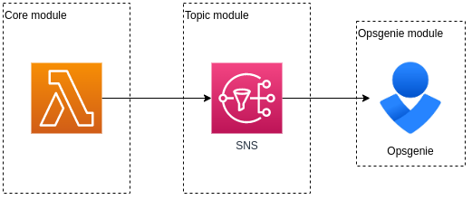
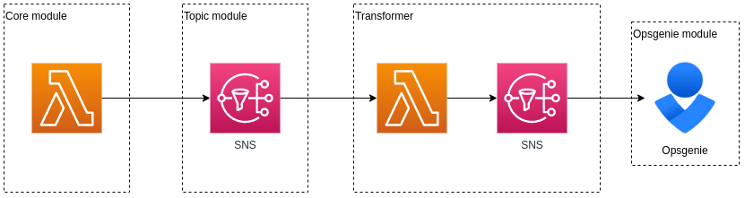

# Custom transformer

Suppose we want to customize the message sent to Opsgenie, without messing with the message sent to Slack. This is simple with Sniffles.

Instead of subscribing the Opsgenie SNS endpoint directly to the Logs SNS topic, we can subscribe a lambda to the Logs SNS topic. The Lambda can modify the message any way we please, and then publish the transformed message to a new SNS topic. Then we can subscribe the Opsgenie SNS endpoint to this new SNS topic.

1. `cp deploy.{template,sh}`
1. Edit `deploy.sh`, fill in the variales
1. `./deploy-all.sh`

Once this has been deployed any Opsgenie SNS subscriptions on the Logs SNS topic previously deployed can be removed, and instead attached to the newly created SNS topic.

### Before

### After

