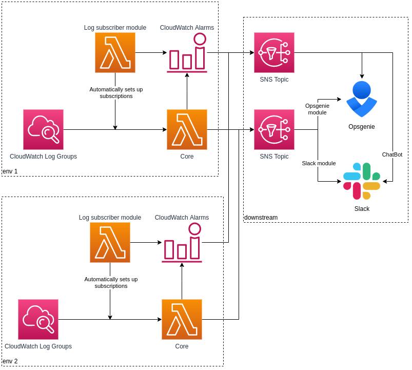

# More complex example

Here we deploy the downstream infrastructure first. This includes the SNS topic the core lambdas post to, and alerting to slack and opsgenie.

This downstream infrastructure is then shared by the core lambdas deployed to 2 different environments.

1. `cp config-downstream.{template,sh}`
1. Edit `config-downstream.sh`, only variables with `[VALUE]` need to be populated
1. `./deploy-all.sh ./path/to/config-downstream.sh`
1. `cp config-env1.{template,sh}`
1. Edit `config-env1.sh`, only variables with `[VALUE]` need to be populated
1. `./deploy-all.sh ./path/to/config-env1.sh`
1. `cp config-env2.{template,sh}`
1. Edit `config-env2.sh`, only variables with `[VALUE]` need to be populated
1. `./deploy-all.sh ./path/to/config-env2.sh`

If you haven't built and uploaded the assets to S3 previously there's an example `deploy-assets.template` as well.
