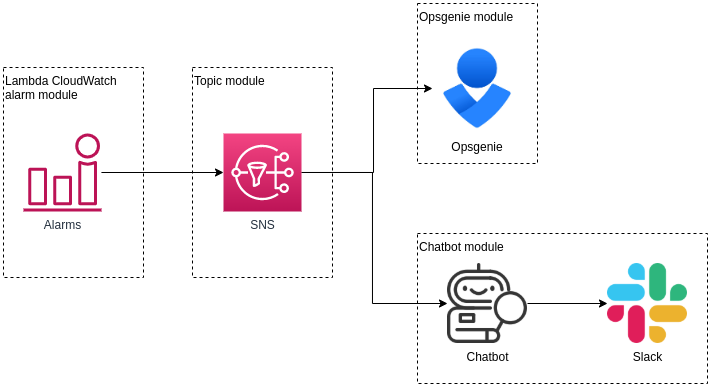

# Only CloudWatch example

This is an excellent option if you want to get notified when an error has been logged in an AWS Lambda, but it's not critical the the alert contains the actual log message.

Simple, cheap, and robust solution.

`shared.sh` needs to be deployed once.

`lambda-alarms.sh` needs to be modified and deployed for each lambda you want to monitor.

